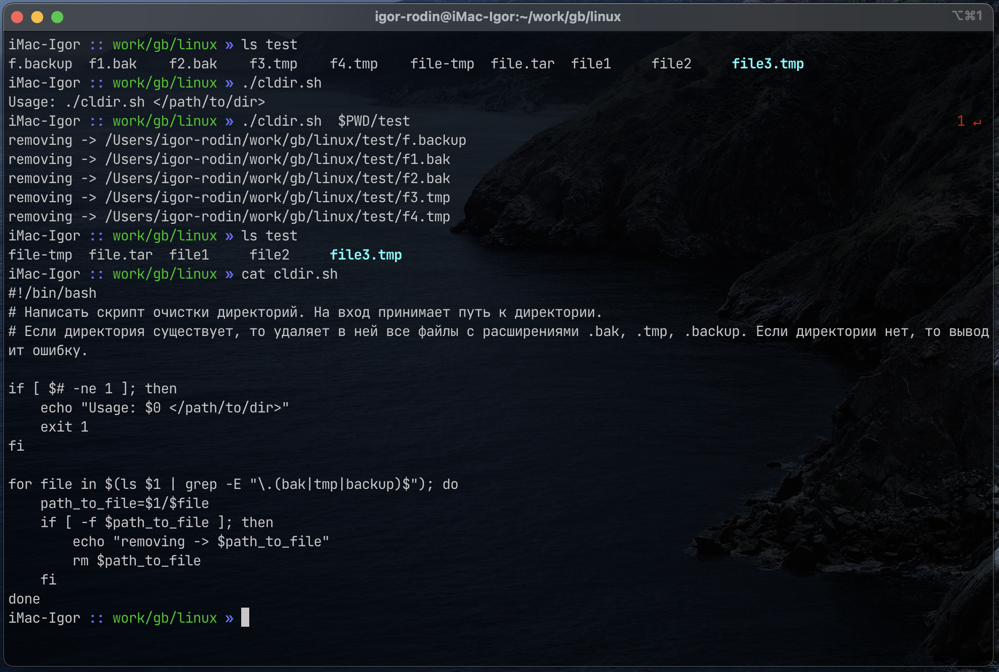
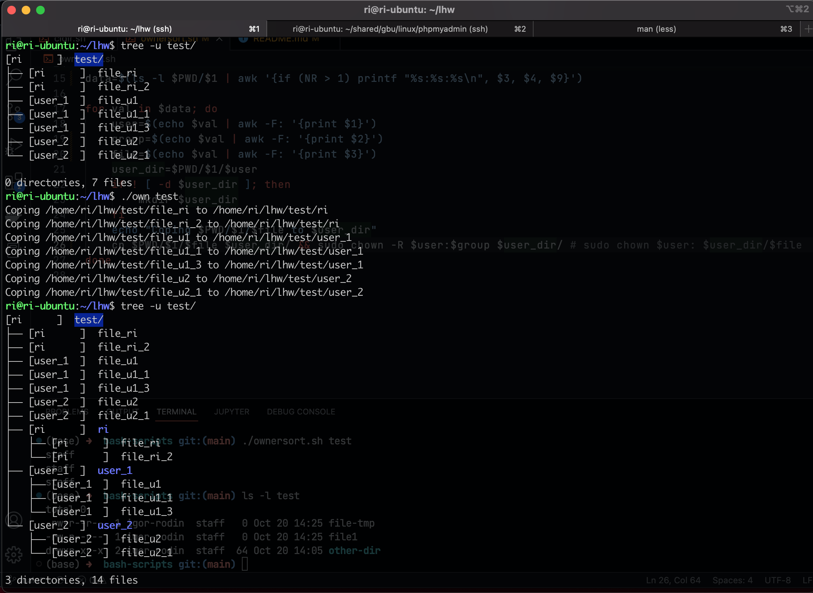

# Урок 8. Скрипты Bash

    
###   Задание 1. Написать скрипт очистки директорий. На вход принимает путь к директории. Если директория существует, то удаляет в ней все файлы с расширениями .bak, .tmp, .backup. Если директории нет, то выводит ошибку.
Скрипт - ```cldir.sh``` :
```
#!/bin/bash

if [ $# -ne 1 ]; then
    echo "Usage: $0 </path/to/dir>"
    exit 1
fi

abs_path=$(realpath $1)

if ! [ -d $abs_path ]; then
    echo "No such directory -> $abs_path"
    exit 1
fi

for file in $(ls $abs_path | grep -E "\.(bak|tmp|backup)$"); do
    path_to_file=$abs_path/$file
    if [ -f $path_to_file ]; then
        echo "removing -> $path_to_file"
        rm $path_to_file
    fi
done

```
- *Скриншот работы скрипта* ``` cldir.sh ```

  

###   Задание 2.* Создать скрипт ```ownersort.sh```, который в заданной папке копирует файлы в директории, названные по имени владельца каждого файла. Учтите, что файл должен принадлежать соответствующему владельцу.

Скрипт - ```ownersort.sh``` :

```
#!/bin/bash

if [ $# -ne 1 ]; then
    echo "Usage: $0 </path/to/dir>"
    exit 1
fi

abs_path=$PWD/$1

if ! [ -d $abs_path ]; then
    echo "No such directory -> $abs_path"
    exit 1
fi

data=$(ls -l $PWD/$1 | awk '{if (NR > 1) printf "%s:%s:%s\n", $3, $4, $9}')

for val in $data; do
    user=$(echo $val | awk -F: '{print $1}')
    group=$(echo $val | awk -F: '{print $2}')
    file=$(echo $val | awk -F: '{print $3}')
    user_dir=$PWD/$1/$user
    if ! [ -d $user_dir ]; then
        mkdir $user_dir
    fi
    echo "Coping $PWD/$1/$file to $user_dir"
    cp $PWD/$1/$file $user_dir/ && sudo chown -R $user:$group $user_dir/
done
```
- *Скриншот работы скрипта* ``` ownersort.sh ```
  
  

